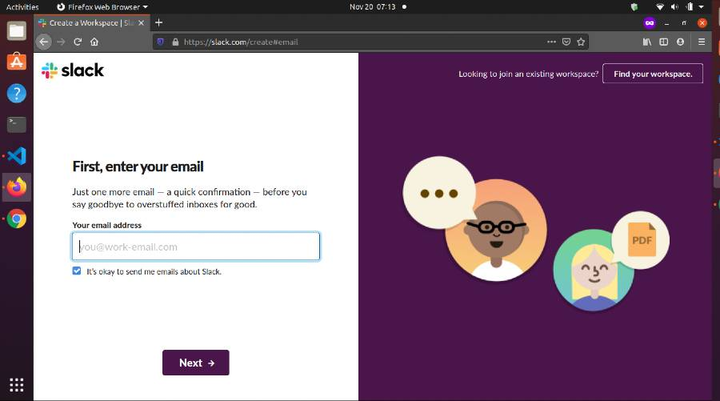
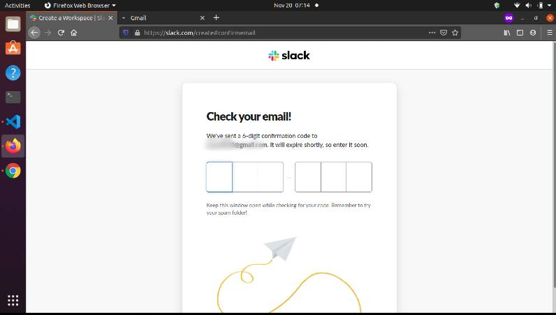
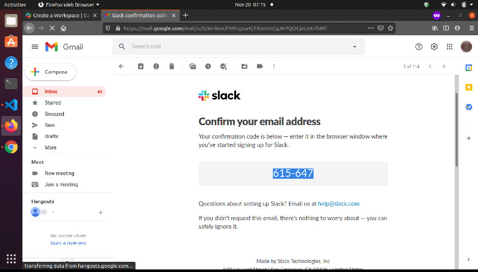
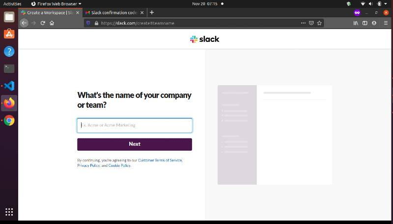
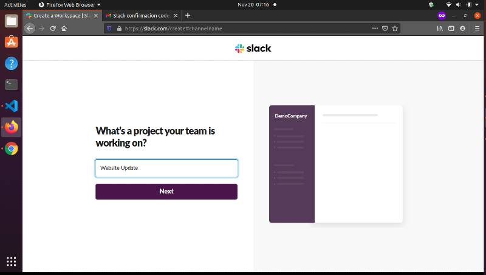
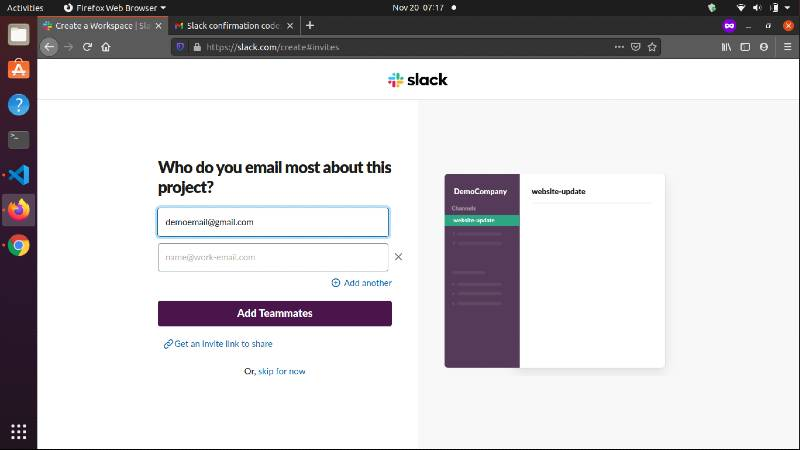
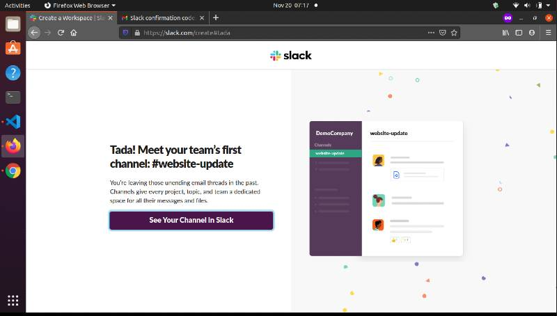
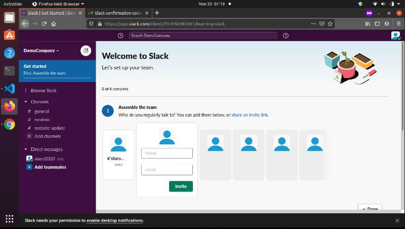
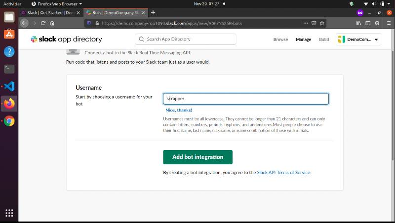
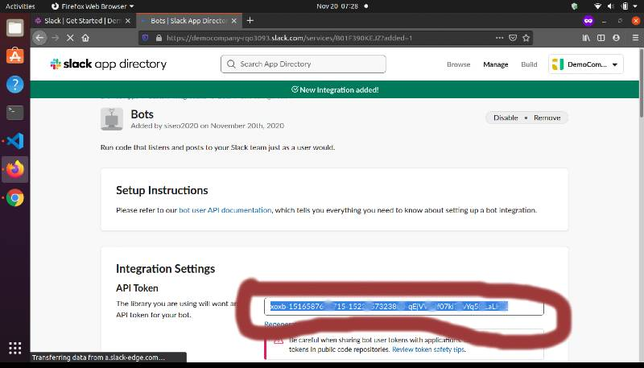

# Wiki and Ebay Sraper_bot for Slack

Table of Content
- - [Create slack workspace](#1)
- - [Create slack bot](#2)
<a name="1"></a><br><br>
## Create a slack workspace

> Follow the screen shots below to create a slack channel

- visit this link https://slack.com/create
- Enter your email (check mail for verification)<br>
<br>

- Enter the verifictaion code<br>
<br>

<br>

- Enter the company name<br>
<br>

- Enter your team name<br>
<br>

- Add some team members via email invitation<br>
<br>

- Enter your slack workspace<br>
<br>
<br>
<a name="2"></a><br><br>
## Create a new bot for your slack workspace

> Follow the screen shots below to create a new bot for your slack workspace

- visit this link http://slack.com/services/new/bot

- Enter the bot username<br>
<br>

- Copy bot API token to use in ```.env```<br>
<br>

- Add integration
- Visit your channel<br>
<br>

## Authors

👤 **Misori Simon**

  - GitHub: [Misori-simon](https://github.com/Misori-simon/)
  - Twitter: [@misori_simon](https://twitter.com/misori_simon)
  - LinkedIn: [Misori Simon](https://cm.linkedin.com/in/misori-simon-05906219b)


## 🤝 Contributing

Contributions, issues, and feature requests are welcome!

## Show your support

Give a ⭐️ if you like this project!

## Acknowledgments
- [Daniel Doubrovkine](https://twitter.com/dblockdotorg) for his [slack-ruby-bot](https://github.com/slack-ruby/slack-ruby-bot/tree/9364f2e33f89d8659a568b66f796930d093f51dc)


